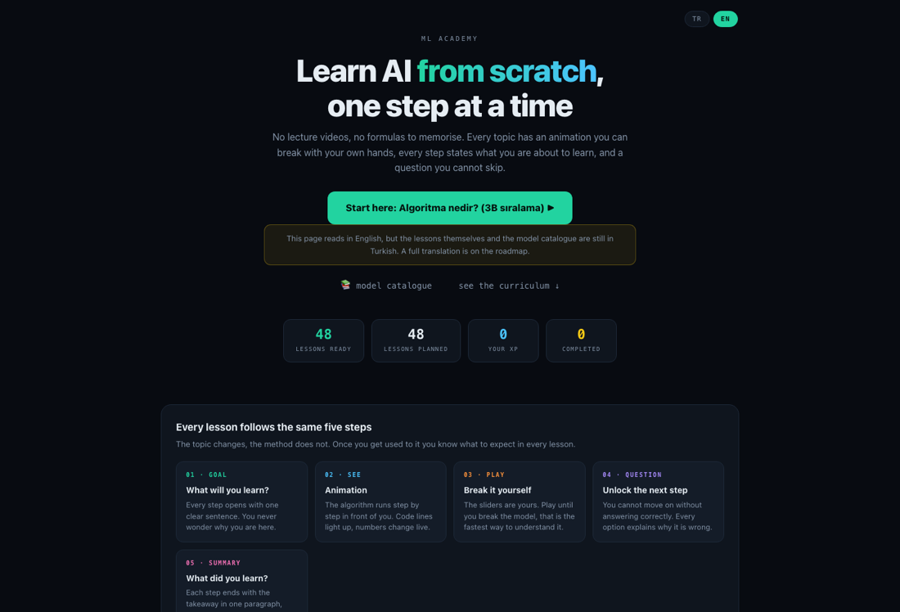
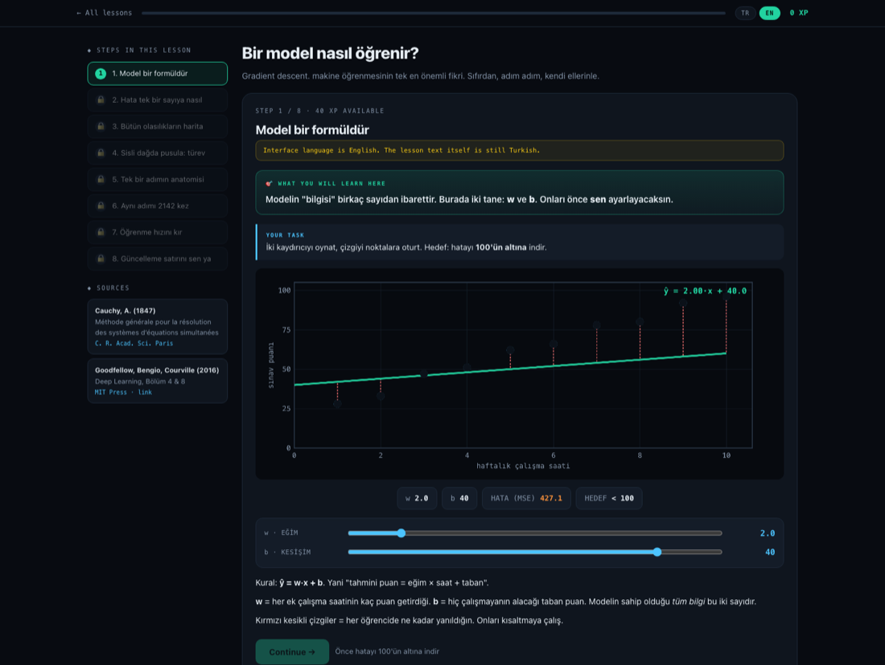

# ML Academy

[Türkçe](README.tr.md) · **English**

An interactive course that teaches machine learning from scratch, running entirely in the browser.

No videos, no installation, no payment. Open `index.html` and start.

The first three lessons of every track are open to anyone. A free account, with no card,
unlocks the remaining lessons and keeps your progress across devices.

**[Live demo](https://mltraining.org)**

> **Note on language.** The interface has a TR/EN switch on the home page and on every lesson page.
> **All 123 lessons are available in English**, including the labels drawn on the canvas. Translations
> live in `content-en.js` and the audit script checks that each one mirrors its Turkish original step
> for step: 122/122 translated, no structural mismatches. The remaining lesson, the 5x2cv F-test, is a
> standalone page with its own English version in `ders-kanit-en.html`.





## Why I built this

There are good interactive sites for machine learning. TensorFlow Playground, Distill.pub, Seeing Theory, Poloclub's CNN and Transformer Explainers. All of them are solid work.

They share one gap: they show you things, but they never check whether you learned anything. You drag a slider, think "neat", and move on. Nobody asks you to commit to a prediction, nobody makes you write the update rule, nobody tells you your intuition was wrong.

This course was built to close that gap. Every lesson does three things.

### Predict before you see

Before the animation runs, you pick an answer. Then the real result arrives. Your hit rate becomes a calibration score, which is the one number that shows where your intuition is unreliable.

### Feel the need before the tool

We do not say "statistical testing matters because...". First you build a model, get a number, and trust it. Then you re-split the data with a different random seed and watch the ranking flip in front of you. Only then do we introduce the tool.

### Prove it by running it

Lessons do not end with a question about the algorithm. They end with the algorithm itself:

```python
for step in range(2000):
    gw, gb = gradient(w, b)
    w = w [ ? ] lr [ ? ] gw
    b = b [ ? ] lr [ ? ] gb
```

You fill the blanks, press RUN, and the code actually executes. Write minus and the loss falls from 2154 to 5.20. Write plus and you watch the model climb the hill and blow up, because you just wrote gradient ascent.

Wrong answers are not rejected. They are executed so you can see what they do.

## Contents

| Track | Topic | Lessons | Steps |
|---|---|---:|---:|
| 0 | Start from zero: algorithms, data, learning, overfitting, metrics, data leakage, statistical evidence | 15 | 55 |
| 1 | Classical machine learning: k-NN, decision trees, random forests, boosting, SVM, soft decision trees, PCA | 37 | 130 |
| 2 | Deep learning: neurons, backpropagation, optimizers, regularization, batch norm, CNNs, embeddings, transfer | 22 | 67 |
| 3 | Large language models: tokenization, attention, transformer block, sampling, RLHF, hallucination, RAG, KV cache | 29 | 94 |
| 4 | Using AI: prompting, eval sets, Elo comparison, RAG debugging, agents, LLM-as-judge, red teaming, cost | 20 | 55 |

**All 123 lessons are ready:** 401 interactive steps, 129 gating questions, 154 unlock
conditions, 387 academic references, 165 visualizations, 19,090 XP.

Every lesson has been translated into English.

There is also a catalogue of 25 models. For each one it lists what it does, how it works, when to use it, when **not** to use it, working code, key hyperparameters and the classic pitfall.

## Some things you can actually do

Fit a line by hand first, then watch gradient descent beat your best score.

Push polynomial degree to 9 and see training error hit 0.0000 while test error jumps to 2.11.

Train a soft decision tree. Five parameters beat CART's seventeen (93.8% against 92.5%). Then drop the temperature to 0.3 and watch it fail to learn at all, because the sigmoid saturates and the gradient vanishes.

Watch a real neural network train in your browser. On a ring dataset it goes from 51.7% to 100% with actual backpropagation.

Measure vanishing gradients. In a sigmoid network the gradient shrinks by roughly a million times across ten layers. Theory says `0.25^9 = 3.8e-6`, the measurement says `1.06e-6`.

Derive Llama-7B's parameter count by hand. 202.4M per block, times 32 layers, plus embeddings, gives 6.74 billion. That is exactly the real number.

See why long context is a memory problem rather than a compute problem. At 128K tokens the KV cache holds 68.7 GB, five times the model weights.

Find out why a 10 sample eval set tells you nothing. An observed 80% could be anything between 49% and 94%.

Run a real 5x2cv F-test on scikit-learn in the browser and pick which test is even the correct one.

## Setup

```bash
git clone https://github.com/cgrtml/ml-academy.git
cd ml-academy
open index.html
```

Or with a local server:

```bash
python3 -m http.server 8000
```

No dependencies, no build step, no server required. One lesson loads Pyodide from a CDN so it can run scikit-learn in the browser.

## Architecture

Content is stored as data, not code. Adding a lesson means writing an object, not a component.

```
index.html        curriculum home, progress, resume where you left off
lesson.html       lesson engine: 4 step kinds, gating, XP, sources
content.js        the curriculum itself: 123 lessons, 401 steps, 387 references
content-en.js     English lesson content, same shape as content.js
viz.js            165 visualizations and every algorithm engine
modeller.html     model catalogue
ders-kanit.html   5x2cv F-test lesson running on Pyodide
dogrula.sh        verification script
```

There are four step kinds:

| Kind | Behaviour |
|---|---|
| `static` | a single visualization and prose |
| `phases` | step through stages with back and forward buttons, code line highlighting |
| `controls` | sliders drive the animation, optional unlock condition |
| `play` | animation plays automatically, with pause and scrubber |

Any step can carry a question (`quiz`) or a working code exercise (`kodlab`).

Every algorithm in `viz.js` was written from scratch: CART with Gini gain, random forest with bootstrap and feature subsampling, gradient boosting stumps, an MLP with backpropagation, logistic regression, linear SVM, soft decision trees, k-means, PCA with Jacobi eigendecomposition, a BPE tokenizer, skip-gram word2vec with negative sampling, and Elo ratings. No libraries. Every number in every lesson comes out of these engines.

## Verification

```bash
./dogrula.sh
```

Three stages.

**Syntax.** All seven source files are parsed.

**Numbers and structure.** 2,395 numeric claims are recomputed and compared against what the lessons say. Every quiz index is checked, every option is required to have an explanation, all 154 unlock conditions are proven reachable by sweeping the parameter space, and `derive`/`control` key collisions are caught. Every translated lesson has to match its Turkish original: same step count, same step kinds, same visualization, same slider ranges, same correct answer index.

**Rendering and layout.** All 165 visualizations are drawn against a stub canvas. A separate sweep measures all 401 steps at real canvas dimensions, looking for overflowing and colliding text.

This script has caught real bugs. Two key collisions that crashed lessons in the browser, a saturation metric computed on the wrong tensor, five lesson numbers left over from an earlier hyperparameter, and an untestable `Path2D` dependency.

The rule is simple: a number does not appear in a lesson unless a test recomputes it.

## Roadmap

- [x] Translate all 123 lessons into English
- [ ] Translate the model catalogue into English
- [ ] Interactive Prompt Arena backed by a real model endpoint
- [ ] Instructor mode with per student seeds, so answers cannot be copied
- [ ] Embeddable widgets for lecture slides and LMS platforms

## Contributing

The most valuable contribution is a new lesson. Write the object in `content.js`, add a visualization to `viz.js` if you need one, put your numeric claims in `denetim.js`, and run `./dogrula.sh`.

Pedagogy bugs are as welcome as code bugs. If a step confused you, that is a bug worth reporting.

## Sources

Every lesson ships with the academic papers it is based on. There are 387 references in total. A few examples: Breiman and colleagues 1984 for CART, Breiman 2001 for random forests, Friedman 2001 for gradient boosting, Cortes and Vapnik 1995 for SVM, Vaswani and colleagues 2017 for attention, İrsoy, Yıldız and Alpaydın 2012 for soft decision trees, Alpaydın 1999 for the 5x2cv F-test.

## License

All rights reserved. The source is public so it can be read, not so it can be
republished. See [`LICENSE`](LICENSE) for what is and is not permitted.

## Author

[Cagri Temel](https://cagritemel.com), author of the [`neural-trees`](https://github.com/cgrtml/neural-trees) library.
