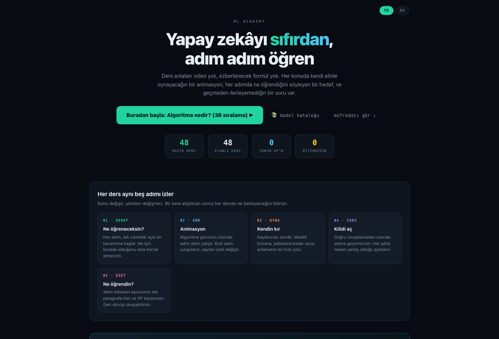
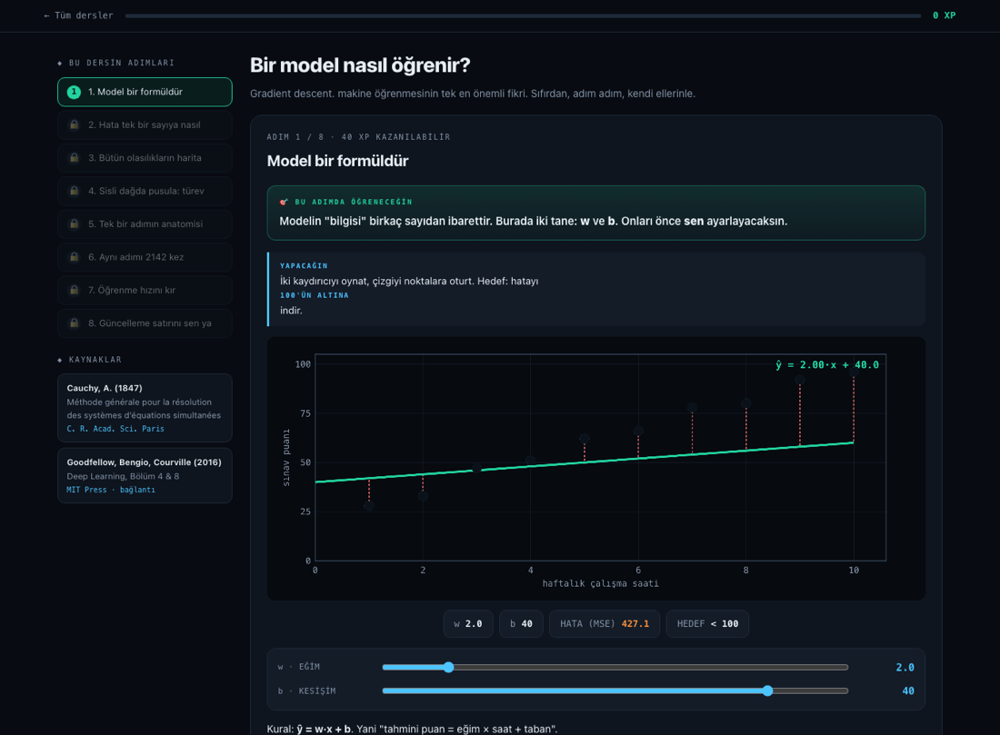

# ML Academy

**Türkçe** · [English](README.md)

Sıfırdan yapay zekâ öğrenmek isteyenler için hazırlanmış, tamamen tarayıcıda çalışan interaktif bir kurs.

Video yok, kurulum yok, ücret yok. `index.html` dosyasını açıp başlıyorsunuz.

Her rotanın ilk üç dersi herkese açık. Kalan dersler için kart istemeyen ücretsiz bir
hesap yeterli; hesap ayrıca ilerlemenizi cihazlar arasında taşıyor.

**[Canlı demo](https://mltraining.org)**

> **Dil hakkında.** Ana sayfada ve her ders sayfasında bir TR/EN düğmesi var. **123 dersin tamamı
> İngilizce olarak mevcut**, görsellerin üstündeki etiketler dâhil. Çeviriler `content-en.js`
> dosyasında duruyor, denetim betiği her çevirinin Türkçe aslıyla adım adım aynı iskelete sahip
> olduğunu kontrol ediyor: 122/122 çevrildi, yapı uyuşmazlığı yok. Kalan ders, 5x2cv F-testi, kendi
> sayfasında duruyor ve İngilizcesi `ders-kanit-en.html` dosyasında.





## Neden yaptım

İnteraktif makine öğrenmesi anlatan güzel siteler var. TensorFlow Playground, Distill.pub, Seeing Theory, Poloclub'ın CNN ve Transformer Explainer'ları. Hepsi iyi işler.

Ama hepsinin ortak bir eksiği var: size gösteriyorlar, öğrenip öğrenmediğinizi kontrol etmiyorlar. Bir kaydırıcıyı oynatıyorsunuz, "güzelmiş" deyip geçiyorsunuz. Kimse sizden tahmin yürütmenizi istemiyor, kimse güncelleme kuralını yazdırmıyor, kimse sezginizin yanlış olduğunu söylemiyor.

Bu kurs o boşluğu kapatmak için yazıldı. Her derste üç şey var.

### Görmeden önce tahmin etmek

Animasyon çalışmadan önce bir cevap seçiyorsunuz. Sonra gerçek sonuç geliyor. Tutturma oranınız kalibrasyon skoru oluyor, yani sezginizin nerede güvenilmez olduğunu gösteren tek sayı.

### İhtiyacı hissettirmek

"İstatistiksel test önemlidir çünkü..." diye anlatmıyoruz. Önce bir model kuruyorsunuz, bir sayı çıkıyor, ona güveniyorsunuz. Sonra veriyi farklı bir rastgele tohumla tekrar bölüyorsunuz ve sıralamanın gözünüzün önünde tersine döndüğünü görüyorsunuz. Aracı ondan sonra tanıtıyoruz.

### Çalıştırarak kanıtlamak

Ders sonunda algoritma hakkında soru sorulmuyor, algoritmanın kendisi yazdırılıyor:

```python
for adim in range(2000):
    gw, gb = gradyan(w, b)
    w = w [ ? ] lr [ ? ] gw
    b = b [ ? ] lr [ ? ] gb
```

Boşlukları doldurup ÇALIŞTIR'a basıyorsunuz, kod gerçekten koşuyor. Eksi yazarsanız kayıp 2154'ten 5.20'ye düşüyor. Artı yazarsanız modelin tepeye tırmanıp patladığını izliyorsunuz, çünkü gradient ascent yazmış oluyorsunuz.

Yanlış cevap reddedilmiyor. Çalıştırılıyor ki ne olduğunu görün.

## İçerik

| Rota | Konu | Ders | Adım |
|---|---|---:|---:|
| 0 | Sıfırdan Başla: algoritma, veri, öğrenme, ezberleme, metrikler, veri sızıntısı, istatistiksel kanıt | 15 | 55 |
| 1 | Klasik Makine Öğrenmesi: k-NN, ağaçlar, Random Forest, boosting, SVM, soft decision tree, PCA | 37 | 130 |
| 2 | Derin Öğrenme: nöron, geri yayılım, optimizerlar, düzenlileştirme, batch norm, CNN, gömmeler, transfer | 22 | 67 |
| 3 | Büyük Dil Modelleri: tokenizasyon, attention, transformer bloğu, örnekleme, RLHF, halüsinasyon, RAG, KV cache | 29 | 94 |
| 4 | AI Kullanma Laboratuvarı: prompt, eval seti, Elo, RAG hata ayıklama, ajanlar, LLM-judge, kırmızı takım, maliyet | 20 | 55 |

**123 dersin tamamı hazır:** 401 etkileşimli adım, 129 kilit açan soru, 154 kilit koşulu,
387 akademik kaynak, 165 görselleştirme, 19.090 XP.

Ders içeriğinin tamamı İngilizceye çevrildi.

Ayrıca 25 modellik bir model kataloğu var. Her model için ne yaptığı, nasıl çalıştığı, ne zaman kullanılacağı, ne zaman kullanılmayacağı, çalışan kod, kilit hiperparametreler ve klasik tuzak yazıyor.

## Örnek olarak neler yapabilirsiniz

Doğruyu önce kendi elinizle oturtup sonra gradient descent'in sizi geçmesini izlemek.

Polinom derecesini 9'a çıkarıp eğitim hatasının 0.0000'a inerken test hatasının 2.11'e fırladığını görmek.

Soft decision tree eğitmek. 5 parametre ile CART'ın 17 parametresini geçiyor (%93.8'e karşı %92.5). Sonra sıcaklığı 0.3'e indirip modelin hiç öğrenemediğini görmek, çünkü sigmoid doyuyor ve gradyan kayboluyor.

Tarayıcıda gerçek bir sinir ağının eğitilmesini izlemek. Halka verisinde %51.7'den %100'e çıkıyor, gerçek geri yayılımla.

Kaybolan gradyanı ölçmek. Sigmoid'de gradyan 10 katmanda yaklaşık bir milyon kat eriyor. Teorik değer `0.25^9 = 3.8e-6`, ölçülen değer `1.06e-6`.

Llama-7B'nin parametre sayısını elle hesaplamak. Blok başına 202.4M, çarpı 32 katman, artı gömmeler, toplam 6.74 milyar. Gerçek değerle birebir aynı.

Uzun bağlamın neden bir bellek problemi olduğunu görmek. 128 bin tokenlik bağlamda KV cache 68.7 GB tutuyor, yani modelin ağırlıklarının beş katı.

10 örneklik bir eval setinin neden hiçbir şey söylemediğini anlamak. Gözlenen %80, gerçekte %49 ile %94 arasında herhangi bir şey olabilir.

Tarayıcıda gerçek scikit-learn ile 5x2cv F-testi çalıştırmak ve hangi testin doğru test olduğunu seçmek.

## Kurulum

```bash
git clone https://github.com/cgrtml/ml-academy.git
cd ml-academy
open index.html
```

Yerel sunucu isterseniz:

```bash
python3 -m http.server 8000
```

Bağımlılık yok, derleme adımı yok, sunucu gerekmiyor. Sadece bir ders (istatistiksel model karşılaştırma) tarayıcıda scikit-learn çalıştırmak için Pyodide'yi CDN'den yüklüyor.

## Mimari

İçerik veri olarak tutuluyor, kod olarak değil. Yeni ders eklemek bir nesne yazmak demek, bileşen yazmak değil.

```
index.html        müfredat ana sayfası, ilerleme, kaldığın yerden devam
lesson.html       ders motoru: 4 adım tipi, kilitler, XP, kaynaklar
content.js        müfredatın kendisi: 123 ders, 401 adım, 387 referans
content-en.js     İngilizce ders içeriği, content.js ile aynı yapıda
viz.js            165 görselleştirme ve bütün algoritma motorları
modeller.html     model kataloğu
ders-kanit.html   Pyodide ile 5x2cv F-testi dersi
dogrula.sh        doğrulama scripti
```

Dört adım tipi var:

| Tip | Davranış |
|---|---|
| `static` | tek görsel ve metin |
| `phases` | ileri geri düğmeleriyle aşama aşama, kod satırı vurgulu |
| `controls` | kaydırıcılar animasyonu sürüyor, isteğe bağlı kilit koşulu |
| `play` | otomatik oynayan animasyon, duraklat ve kaydırma çubuğu |

Her adıma bir soru (`quiz`) veya çalışan bir kod alıştırması (`kodlab`) eklenebiliyor.

Bütün algoritmalar `viz.js` içinde sıfırdan yazıldı. Gini kazançlı CART, bootstrap ve rastgele özellikli Random Forest, gradient boosting kütükleri, geri yayılımlı MLP, lojistik regresyon, lineer SVM, soft decision tree, k-means, Jacobi özçözümlü PCA, BPE tokenizer, negatif örneklemeli skip-gram word2vec, Elo sıralaması. Hiçbir kütüphane kullanılmadı. Derslerdeki bütün sayılar bu motorlardan çıkıyor.

## Doğrulama

```bash
./dogrula.sh
```

Üç aşama var.

**Sözdizimi.** Yedi kaynak dosyanın hepsi ayrıştırılıyor.

**Sayı ve yapı.** 2395 sayısal iddia yeniden hesaplanıp ders metninde yazan değerle karşılaştırılıyor. Her soru indeksi kontrol ediliyor, her şıkkın açıklaması olması zorunlu tutuluyor, 154 kilit koşulunun tamamının parametre uzayı taranarak açılabilir olduğu kanıtlanıyor, `derive` ve `control` anahtar çakışmaları yakalanıyor. İngilizce çevrilen her ders, Türkçe aslıyla aynı adım sayısına, aynı adım tipine, aynı görsele, aynı kaydırıcı aralıklarına ve aynı doğru şık indeksine sahip olmak zorunda.

**Çizim ve yerleşim.** 165 görselin hepsi sahte bir canvas üzerinde çiziliyor. Ayrı bir tarama 401 adımın tamamını gerçek tuval boyutlarında ölçüp taşan ve üst üste binen metin arıyor.

Bu script gerçek hatalar yakaladı. Tarayıcıda ders çökerten iki anahtar çakışması, yanlış tensör üzerinden hesaplanan bir doygunluk metriği, eski bir hiperparametreden kalma beş ders sayısı ve test edilemeyen bir `Path2D` bağımlılığı.

Kural şu: bir sayı, testi onu yeniden hesaplamıyorsa derste yer alamaz.

## Yol haritası

- [x] 123 dersin tamamının İngilizceye çevrilmesi
- [ ] Model kataloğunun İngilizceye çevrilmesi
- [ ] Gerçek bir model uç noktasına bağlı interaktif Prompt Arena
- [ ] Eğitmen modu: öğrenci başına farklı tohumla ödev üretici, böylece kopya yapısal olarak imkânsız
- [ ] Ders slaytlarına ve LMS'e gömülebilir widget'lar

## Katkı

En değerli katkı yeni bir ders. `content.js` içine nesneyi yazın, gerekiyorsa `viz.js` içine görselleştirmeyi ekleyin, sayısal iddialarınızı `denetim.js` içine koyun ve `./dogrula.sh` çalıştırın.

Pedagoji hataları da kod hataları kadar değerli. Bir adım kafanızı karıştırdıysa o bir hatadır, issue açın.

## Kaynaklar

Her ders, dayandığı akademik makalelerle birlikte geliyor. Toplam 387 referans var. Örnek olarak: CART için Breiman ve arkadaşları 1984, Random Forest için Breiman 2001, gradient boosting için Friedman 2001, SVM için Cortes ve Vapnik 1995, attention için Vaswani ve arkadaşları 2017, soft decision tree için İrsoy, Yıldız ve Alpaydın 2012, 5x2cv F-testi için Alpaydın 1999.

## Lisans

Telif hakkı saklıdır. Kaynak okunabilir olsun diye açık, yeniden yayımlanabilsin
diye değil. Ayrıntı [`LICENSE`](LICENSE) dosyasında.

## Yazar

[Cagri Temel](https://cagritemel.com). [`neural-trees`](https://github.com/cgrtml/neural-trees) kütüphanesinin yazarı.
